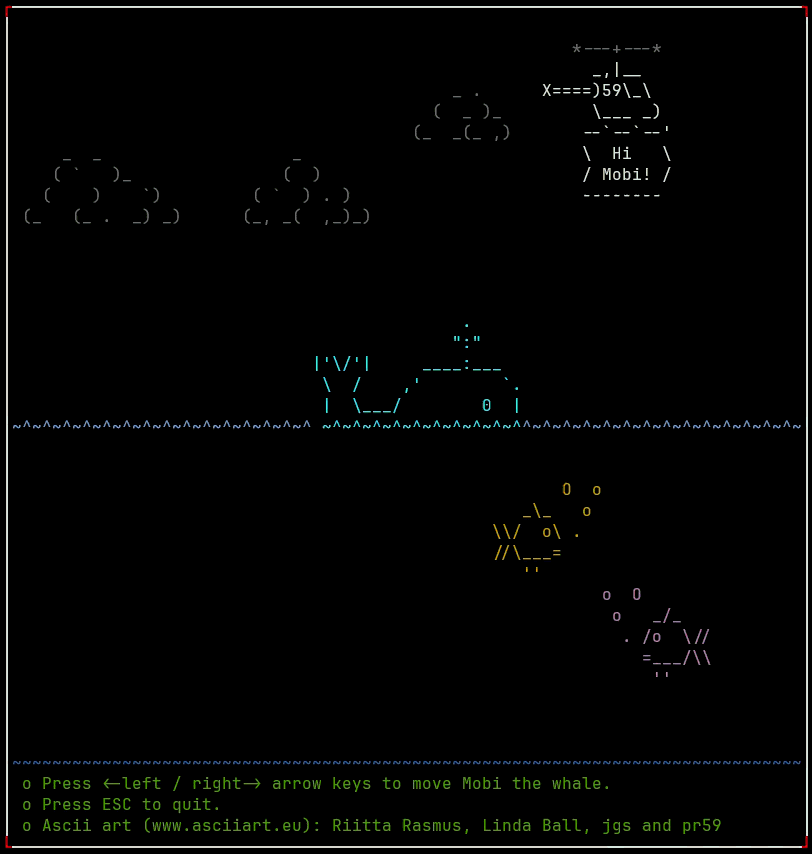

# Welcome to Nasm64-TUI Assembly!

### 🔥 Motivation

This project is a hands-on approach to learning x86-64 assembly by building interactive terminal applications. I wanted to make learning practical and fun by creating visual results, such as moving characters around the screen.
We start with some `basics` and then move on to `fun_tui` to build something more complex like these: 

<div>


</div>

sources: [fun_tui](./fun_tui/)

## Table of Contents

- [Introduction](#-introduction)
- [Prerequisites and Setup](#-prerequisites-and-setup)
- [The System V AMD64 ABI](#-the-system-v-amd64-abi)
  - [1. Calling convention](#-1-calling-convention)
  - [2. Register Preservation](#-2-register-preservation)
  - [3. Stack Layout and Alignment](#-3-stack-layout-and-alignment)
- [Project Structure](#-project-structure)
- [Resources](#-resources)
- [Contributing](#-contributing)


## 👋 Introduction

After going through "Prerequisites and Setup", feel free to jump directly to the `basics` or `fun_tui` directory.
However, for those new to NASM x64 assembly programming, I strongly advise reviewing the following:

- The [x64 Basic Reference](./readme_x86_64_reference.md) for a quick overview.
- The [The System V AMD64 ABI](#-the-system-v-amd64-abi) section below for essential context.


## 🔰 Prerequisites and Setup
To build and run these examples, you will need:
- A 64-bit Linux operating system (WSL is a great option if you are using Windows)
- `nasm` (The Netwide Assembler)
- `gcc`  (The GNU Compiler Collection) and `ld` (GNU linker)
- `make` (GNU Make)

You can install these on your Linux system using commands similar to the following:
```bash
sudo apt-get install nasm gcc make # (Debian-based system like Ubuntu)
sudo dnf install nasm gcc make     # (RHEL-based system like Rocky Linux)
```
## 🎋 Project Structure

The project is organized as follows:
```
.
├── examples/                # Basic examples.
│   ├── ex_a1_first/         # Minimal first example program (exit code)
│   ...                      # ...
│   └── readme.md            # Example specific documentation
├── fun_tui/                 # Terminal UI programs.
├── images/                  # Images used in the documentation.
├── readme.md                # Main project documentation.
├── readme_x64_reg_ref.md    # x86-64 register reference and additional documentation. 
├── .gitignore
```

## 🎡 The System V AMD64 ABI

The System V AMD64 ABI (Application Binary Interface) is a standard set of rules governing how software operates on x86-64 (or AMD64) processors for Unix-like and POSIX-compliant operating systems like Linux. This ABI defines fundamental low-level interactions, including function calling conventions (e.g., how arguments are passed), register preservation, data structure alignment, and the specifications for the executable and linking format (such as ELF64 on Linux). Adherence to this standard is crucial as it ensures maximum software compatibility, predictable behavior, and seamless integration with standard shared libraries like libc. 
While macOS is also POSIX-compliant, it uses a distinct variation of the ABI, and Windows has its own Microsoft x64 ABI.

Let's go through the key aspects of the ABI:

1.  [**Calling convention**](#-1-calling-convention): Specifies which CPU registers are used to pass the first six integer or pointer arguments, how additional arguments are put onto the stack and which registers are used to return values from a function.
2.  [**Register Preservation**](#-2-register-preservation): Specifies which registers a function must "save and restore" so it doesn't mess with the caller's data.
3.  [**Stack layout and alignment**](#-3-stack-layout-and-alignment): Details how the stack is set up and managed during function calls.

Let's dive deeper into these topics: 


### 🔀 1. Calling convention
The calling convention depends on the type of function being written or called. The types of functions (that we mostly encounter) are [A.Regular functions](#a-regular-functions), [B.System calls](#b-system-calls), [C.Variadic functions](#c-variadic-functions), [D.Functions returning structures (by value)](#d-functions-returning-structures-by-value).

#### A. Regular functions
This is the most common type of function.
-   **Parameter passing**:
  - Integer/Pointer Arguments: The first six integer or pointer arguments are passed in registers in the following order: (**`rdi, rsi, rdx, rcx, r8, r9`**). 
  - Floating-point arguments use the first **eight** SSE/AVX registers (`xmm0-xmm7`). 
  - Any remaining arguments are pushed onto the stack.
-   **Return values**:
    -   For integers and pointers up to 64 bits, the return value is placed in `rax`. If a 128-bit integer is returned, `rdx:rax` is used (high 64 bits in `rdx`, low in `rax`).
    -   For floating-point values, the return value is placed in `xmm0`.
    -   For larger or more complex return types (like large structures), the caller allocates space on the stack and passes a pointer to this space as a hidden first argument in `rdi`. The function then writes its result to that memory location. 

#### B. System calls
System calls are how a user-space program requests services from the Linux kernel. They have a different, specific calling convention.
-   **Parameter passing**: 
  - The system call number is passed in the **`rax`** register. 
  - The arguments are passed in the following order: (**`rdi, rsi, rdx, r10, r8, r9`**). Note that in regular functions, the fourth argument was different. 
-   **Invoking the call**: The `syscall` instruction is used to perform the call, which transitions the program from user mode to kernel mode (a more privileged mode).
-   **Return value**: The result of the system call is returned in `rax`. 
> [!Note] 
> If we check the linux kernel source `linux/arch/x86_64/entry.S ` online, in the comment section of `64-bit SYSCALL instruction entry` they have an interesting comment `r10 arg3 (needs to be moved to rcx to conform to C ABI)`. This means that because the fourth argument (often referred to as arg3, starting from arg0) was originally placed in `r10` during system call entry, the kernel moves it to `rcx` before calling an internal C function. This ensures adherence to the standard C calling convention.

#### C. Variadic functions
This category includes functions like `printf()` that can accept a variable number of arguments.

-   **Parameter passing**: The rules are generally the same as for regular functions, but there is a special requirement. Before the call, the `rax` register must be set to the total number of floating-point registers (`xmm0-xmm7`) used for arguments.
-   **Return value**: The return value for variadic functions follows the same rules as regular functions. 

#### D. Functions returning structures (by value)
As mentioned under regular functions, the ABI has specific rules for returning structures.

-   **Small structures**: If a structure or union is small enough to fit within 16 bytes (a `__m128` type, for example), it can be returned directly in registers, using `rax` for the lower 64 bits and `rdx` for the upper 64 bits.
-   **Large structures**: For larger structures, the caller must allocate memory and provide a pointer to it in `rdi`. The function then writes the return value directly into this pre-allocated memory.
 

### 💾 2. Register Preservation

Register preservation is a **fundamental rule** ensuring a program's state remains intact across function calls. Since the total number of general-purpose registers is limited, a split is necessary to balance performance and convenience between a function that calls another (**caller**) and the function being called (**callee**). This results in two categories:

| Category | Registers | Role & Responsibility |
| :---: | :---: | :--- |
| 📞 **Caller-saved** | `rax, rcx, rdx, rsi, rdi, r8, r9, r10, r11` | The caller must save them if it needs their values after the function returns. The callee (function being called) is free to overwrite them. |
| 🛡️ **Callee-saved** | `rbx, rbp, r12, r13, r14, r15` | The callee (function being called) **must** save the original values of these registers on the stack and restore them before returning. The caller can assume these values will remain unchanged.|
| Special Purpose | `rsp` and `rip` | Managed automatically by call/ret and stack manipulation instructions (push, pop, sub, add). |

> [!Note] 
> 📞Caller-saved registers are considered **volatile** registers.They are primarily used for fast temporary operations, function   
arguments, and return values. 
🛡️Callee-saved registers are considered **non-volatile** and are typically used to hold local variables, pointers, or addresses that need to persist across multiple nested function calls.


### 🧱 3. Stack Layout and Alignment

> ℹ️ When a program starts, the operating system allocates an initial block of memory for the stack. This block is part of the process's address space and is typically located at a high memory address, growing downwards towards lower addresses. The OS (loader) sets up the initial `rsp` (stack pointer) register to point to the top of this allocated stack space

> ℹ️ The `push` instruction performs two actions **atomically**. It decrements the stack pointer and stores the data. Decrementing the stack pointer (stack grows downwards) allocates new space at a lower address for the data being pushed.

#### 🔗 The `call` and `ret` Instructions
In x86-64 assembly, the `call` instruction transfers control to a function, and `ret` returns control to the caller.
1. `call function_label`:
    * It pushes the 8-byte address of the instruction following the call (the return address) onto the stack.
    * It jumps to function_label by setting `rip` register to the function's address.
2. `ret`:
    * It pops the 8-byte return address from the stack into `rip`.
    * Execution resumes at that address, returning control to the caller.

Now, let's understand how the stack is set up and managed during function calls/execution.
Function execution is governed by the **Prologue** (entry) and **Epilogue** (exit), which manage the stack and registers.
So it can be broken down into three main parts:

-   **📜 Prologue**: Sets up the function's execution environment.
-   **🥪 Body**: Contains the core logic of the function.
-   **🎬 Epilogue**: Cleans up and returns control to the caller.


#### 📜 Function Prologue
The prologue prepares the stack and registers for the function to execute correctly.

1.  **Save the Caller's Frame (Base Pointer)**

    This step is necessary if we intend to use `rbp` as a stable stack frame pointer. 
    Push `rbp` register (base pointer or frame pointer) of the calling function onto the stack. This preserves the caller's stack frame (allowing it to be restored later) and links the new frame to the old one, enabling debuggers to trace the function call chain (stack trace).

    ```nasm
    push rbp ; save the old base pointer
    ```

2.  **Establish the New Stack Frame**

    Copy the current stack pointer `rsp` to `rbp`. This creates a stable reference point (`rbp`) for accessing arguments and local variables throughout the function. 
    How is `rbp` going to be a stable reference point? 
    The stack pointer `rsp` moves automatically as we push and pop data.However, we have more direct control over `rbp`. We will manually set `rbp` once at the beginning of the function and keep it unchanged throughout the function.

    ```nasm
    mov rbp, rsp ; set up the new stack frame
    ```
    This combined action of *Point 1 and 2* creates a dedicated, isolated workspace on the stack, which is essential for managing the function's local context and enabling state-independent operations like recursion. It's also the *standard prologue sequence*.

3.  **Save Callee-Saved Registers**

    If the function intends to use any callee-saved registers (e.g., `rbx`, `r12`-`r15`), their original values must be saved on the stack first.

    ```nasm
    ; Save registers that the function will modify
    push rbx
    push r12
    ```

4.  **Allocate Space for Local Variables**

    If a function requires local storage, space is reserved immediately on the stack by **subtracting** the required byte count from the stack pointer `rsp`. As the stack is a pre-allocated memory region, allocation and deallocation are extremely fast, relying only on simple pointer arithmetic.

    ```nasm
    sub rsp, 16 ; Allocate 16 bytes for local variables
    ```
#### 🥪 Function Body

This is where the function's primary logic resides. Here, we can:

-   Access arguments passed via registers (e.g., `rdi`, `rsi`).
-   Use local variables stored on the stack (e.g., `[rbp - 8]`).
-   Perform calculations and other operations.

#### 🎬 Function Epilogue

The epilogue reverses the actions of the prologue to clean up the stack and restore the caller's state.

1.  **Restore Callee-Saved Registers**

    Pop the saved registers from the stack in the reverse order they were pushed.

    ```nasm
    ; Restore the saved registers
    pop r12
    pop rbx
    ```

2.  **Deallocate Local Variables and Restore Frame**

    The stack pointer is reset to the base pointer, effectively discarding the local variables.

    ```nasm
    mov rsp, rbp ; deallocate local variables (read `4. Allocate Space for Local Variables`)
    pop rbp      ; restore the caller's base pointer
    ```
    > **💡 Tip**: The `leave` instruction can perform both of the above steps in a single operation.

3.  **Return Control**

    The `ret` instruction pops the return address from the stack and jumps to it, returning control to the caller.

    ```nasm
    ret
    ```

#### ⚠️ The Critical 16-byte Stack Alignment Rule
The System V AMD64 ABI requires that the stack pointer (`rsp`) must be aligned to a 16-byte boundary before the call instruction is executed. 
Now, let's track this alignment requirement:
* When a program starts, the operating system's loader ensures the initial `rsp` is 16-byte aligned.
* The call instruction to our program's entry point function (`_start` or `main`) pushes an 8-byte return address to the stack making the `rsp` unaligned ($16n + 8$).
* Therefore, the function's prologue must ensure that any work done (like pushing `rbp`, saving callee-saved registers, and allocating local space) results in `rsp` being 16-byte aligned *before* its own internal `call` is made.

#### 🔧 Handling Alignment for Nested Calls (Non-Leaf Functions)
If our function needs to call another function (a non-leaf function), we must manually ensure the stack is 16-byte aligned before the nested call.

1. Standard Prologue: `push rbp` then `mov rbp, rsp`. 
   `push rbp` corrects the 8-byte offset from the call instruction and makes the stack 16-byte aligned.
2. Local Variables: If we allocate locals, we have to ensure that the total allocation (plus the initial 8-byte offset from the call instruction) keeps the stack 16-byte aligned before any nested call.

Example of a simple Non-leaf function (Uses no locals, but calls another function (puts)):

```nasm
extern puts              ; puts is in c std lib

func_asm_print:
    ; Standard Prologue
    push rbp             ; rsp is now 16-byte aligned (Corrects the 8-byte offset from the previous `call`)
    mov rbp, rsp         ; Set up the new stack frame

    push rbx             ; For example, if we decide to use `rbx` in this function, `rbx` being a callee-saved register,
                         ; must be saved first (ideally on stack, by push instruction). However, this
                         ; misaligns the stack by 8 bytes.
    sub rsp - 8          ; To align the stack back to a 16-byte boundary (padding), we could have also aligned the stack by
                         ; pushing another 8-byte register.
    
    ; 1. Pass argument (`rdi` is 1st argument register)
    mov rdi, hello_str   ; Load pointer to string
    
    ; 2. Execute the nested call 
    ; rsp is 16-byte aligned before this instruction. (ABI satisfied)
    call puts            ; `call` pushes 8 bytes. The `puts` function correctly receives a stack pointer that is `(16n + 8)`
    
    add rsp, 8           ; Undo the padding
    pop rbx              ; Restore callee-saved register
    ; Standard function epilogue
    leave                ; mov rsp, rbp; pop rbp
    ret
```
#### 🔧🍃 Handling Alignment for Leaf Functions (Calling No Other Functions)
**Optimizations for Leaf Functions**
If a leaf function doesn't need local variables on the stack and only uses temporary (caller-saved) registers, it may not need a prologue or epilogue at all—it can just `ret`.


### 🔋 Additional Concepts

#### 1. Register Choice (Caller- vs. Callee-Saved)

The choice of which register category to use is a performance trade-off:

* **Use Caller-Saved** (`rax, rcx, rdx, rsi, rdi, r8, r9, r10, r11`): Best used for temporary, short-lived values and arithmetic results. If persistence is needed across a function call, the caller must manually save the register to the stack.

* **Use Callee-Saved** (`rbx, rbp, r12, r13, r14, r15`): Ideal for long-lived variables, such as loop counters, pointers to memory blocks, or base pointers (rbp), which need to persist across multiple nested function calls. They are protected across calls via a single push/pop pair (prologue/epilogue). This makes them efficient for variables used in loops that perform many function calls.

#### 2. When to Use `jmp`
`jmp` is appropriate for unconditional jumps where no return is expected, such as:
- Jumping to a different part of the same function.
- Implementing loops or branching logic. However, for function calls where a return to the caller is expected, `call` and `ret` should always be used. 
  This is especially important when handling the stack manually (i.e., using a function prologue and epilogue).


## 📚 Resources

- [NASM Docs](https://www.nasm.us/doc/)
- [x86 Registers Image](https://commons.wikimedia.org/wiki/File:Table_of_x86_Registers_svg.svg)
- [Syscall Reference](https://www.chromium.org/chromium-os/developer-library/reference/linux-constants/syscalls/)
- [Intel Manuals](http://www.intel.com/content/www/us/en/processors/architectures-software-developer-manuals.html)

## 🤝 Contributing 

Contributions are welcome! If you have an idea for a new example or an improvement to an existing one, please feel free to open an issue or submit a pull request.
