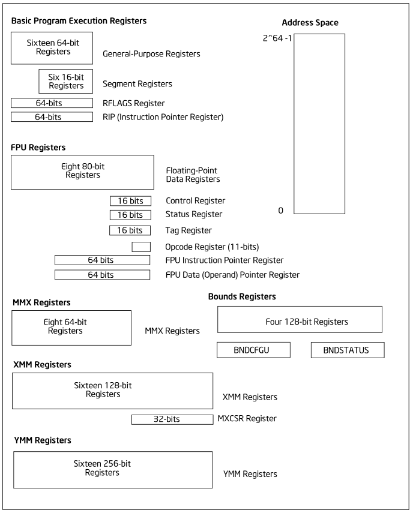
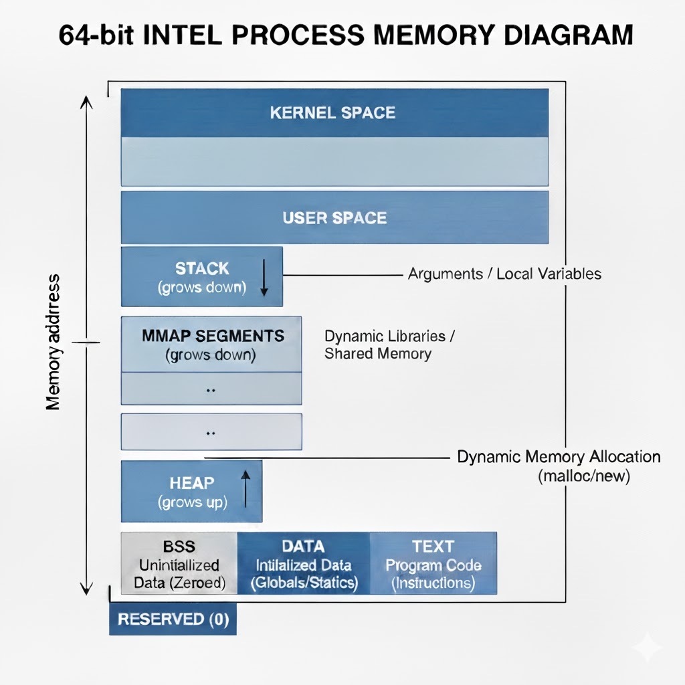

# 💻 x64 (Intel/AMD64) Basic Reference

The x64 architecture extends the classic x86 instruction set by doubling the size of registers to 64 bits and increasing the number of General-Purpose Registers (GPRs) from 8 to 16.

---

## 🚀 64-bit General-Purpose Registers (GPRs)

These are the primary registers used for data manipulation and addressing. All GPRs are 64 bits wide.

The first eight registers retain historical names, while the eight new registers are numerically named (`r8`-`r15`). In the table below, the register names reflect their various accessible sizes: 64-bit (`r*`), 32-bit (`e*`), 16-bit (`*x`), and 8-bit (high/low).

| 64-bit (qword) | 32-bit (dword) | 16-bit (word) | 8-bit (low/high) | Primary Role                      | Convention                             | Comment                                                                        |
| :-----------------: | :-------------------: | :-------------: | :----------------: | :---------------------------------- | :--------------------------------------- | :------------------------------------------------------------------------------- |
|     **`rax`**     |        `eax`        |     `ax`     |    `al`, `ah`    | **Accumulator**                   | Function Return Value, 📞 Caller-saved |                                                                                |
|     **`rbx`**     |        `ebx`        |     `bx`     |    `bl`, `bh`    | **Base Register**                 | 🛡️ Callee-saved                      |                                                                                |
|     **`rcx`**     |        `ecx`        |     `cx`     |    `cl`, `ch`    | **Counter**, Argument 4           | 📞 Caller-saved                        |                                                                                |
|     **`rdx`**     |        `edx`        |     `dx`     |    `dl`, `dh`    | **Data Register**, Argument 3     | 📞 Caller-saved                        |                                                                                |
|     **`rsi`**     |        `esi`        |     `si`     |      `sil`      | **Source Index**, Argument 2      | 📞 Caller-saved                        |                                                                                |
|     **`rdi`**     |        `edi`        |     `di`     |      `dil`      | **Destination Index**, Argument 1 | 📞 Caller-saved                        |                                                                                |
|     **`rsp`**     |        `esp`        |     `sp`     |      `spl`      | **Stack Pointer**                 | Special Purpose                        | Managed by call/ret and stack manipulation instructions (push, pop, sub, add). |
|     **`rbp`**     |        `ebp`        |     `bp`     |      `bpl`      | **Base Pointer** (Frame Pointer)  | 🛡️ Callee-saved                      |                                                                                |
|     **`r8`**     |        `r8d`        |     `r8w`     |      `r8b`      | Argument 5                        | 📞 Caller-saved                        |                                                                                |
|     **`r9`**     |        `r9d`        |     `r9w`     |      `r9b`      | Argument 6                        | 📞 Caller-saved                        |                                                                                |
|     **`r10`**     |       `r10d`       |    `r10w`    |      `r10b`      | Temporary                         | 📞 Caller-saved                        | 4th argument in Linux system calls                                             |
|     **`r11`**     |       `r11d`       |    `r11w`    |      `r11b`      | Temporary                         | 📞 Caller-saved                        |                                                                                |
|     **`r12`**     |       `r12d`       |    `r12w`    |      `r12b`      | General                           | 🛡️ Callee-saved                      |                                                                                |
|     **`r13`**     |       `r13d`       |    `r13w`    |      `r13b`      | General                           | 🛡️ Callee-saved                      |                                                                                |
|     **`r14`**     |       `r14d`       |    `r14w`    |      `r14b`      | General                           | 🛡️ Callee-saved                      |                                                                                |
|     **`r15`**     |       `r15d`       |    `r15w`    |      `r15b`      | General                           | 🛡️ Callee-saved                      |                                                                                |

> ❌ In 64-bit mode, the `ah`, `bh`, `ch`, and `dh` registers are largely obsolete. 

For 64-bit programming, the 8-bit registers `al`, `bl`, `cl`, and `dl` should be used to access the lower byte of `rax`, `rbx`, `rcx`, and `rdx`, respectively.

> ℹ️ **Argument Order** *(6 registers)* : **`rdi, rsi, rdx, rcx (r10 for syscall), r8, r9`** .

> ℹ️ **📞Caller-saved** *(9 registers)*: `rax`, `rcx`, `rdx`, `rsi`, `rdi`, `r8`, `r9`, `r10`, and `r11` may be modified by the called function, so the caller is responsible for saving them if they are needed after the function call.

> ℹ️ **🛡️Callee-saved** *(6 registers)*: `rbx`, `rbp`, `r12`, `r13`, `r14`, and `r15` must be preserved by a function (see the function prologue/epilogue example in `readme.md`) if it intends to use them.

> ℹ️ 📞Caller-saved registers are considered **volatile** registers. They are primarily used for fast temporary operations, function arguments, and return values. 🛡️Callee-saved registers are considered **non-volatile** and are typically used to hold local variables, pointers, or addresses that need to persist across multiple nested function calls.

---

## ⚙️ Instruction Pointer and Flags

These registers are critical for program execution flow and status tracking.

|   Register   |  Size  | Description                                                                                                                                                                                                           |
| :------------: | :------: | :---------------------------------------------------------------------------------------------------------------------------------------------------------------------------------------------------------------------- |
|  **`rip`**  | 64-bit | **Instruction Pointer**. Holds the address of the next instruction to be executed.                                                                                                                                    |
| **`rflags`** | 64-bit | **Status and Control Flags**. Contains single-bit flags like **`cf`** (Carry), **`zf`** (Zero), **`sf`** (Sign), **`of`** (Overflow), and others that reflect the result of the ***last arithmetic or logical operation***. |

---

## 💾 SIMD/Vector Registers

x64 processors support powerful Single Instruction, Multiple Data (SIMD) operations using dedicated registers for parallel processing.

|        Registers        |  Size  | Architecture | Description                                                                                  |
| :------------------------: | :-------: | :------------: | :--------------------------------------------------------------------------------------------- |
| **`xmm0`** - **`xmm15`** | 128-bit |   SSE/SSE2   | Used for packed single-precision (32-bit) and double-precision (64-bit) floating-point data. |
| **`ymm0`** - **`ymm15`** | 256-bit |     AVX     | Extension of`xmm` registers for processing larger vectors.                                   |
| **`zmm0`** - **`zmm31`** | 512-bit |   AVX-512   | Further extension (available on newer Intel processors) for even larger vector operations.   |

## 📋 Basic x86-64 Assembly Instructions

1. Data Transfer

| **Mnemonic** | **Description**| **Example**|
| ----------------- | ---------------------------------------------------------------------------------------------------------------------------- | ---------------------------- |
| `mov`           | copy data from source to destination                                                                               | `mov rax, rbx`             |
| `push`          | push data onto the stack (decrements `rsp` then stores data)                                                           | `push rbp`                 |
| `pop`           | pop data from the stack (retrieves data then increments `rsp`)                                                         | `pop rbp`                  |
| `lea`           | load effective address: calculates the memory address and loads the **address value** into the destination | `lea rax, [rbx + rcx * 4]` |
| `movsx`         | move with **sign-extension** (promotes a smaller signed value to a larger size)                                            | `movsx rax, ebx`           |
| `movzx`         | move with **zero-extension** (promotes a smaller unsigned value to a larger size, filling with zeros)                      | `movzx eax, bl`          |

> ℹ️ In the `movzx` example, `bl` is zero-extended to 32 bits and written into `eax` the CPU then automatically zero-extends it into the full 64-bit register `rax`. In the Intel 64 architecture, for an instruction like `mov eax, ebx`, the upper 32 bits of `rax` are automatically zeroed. This simplifies operations when working with 32-bit values in a 64-bit environment.

2. Arithmetic

| **Mnemonic** | **Description**                                                     | **Example**     |
| ----------------- | ---------------------------------------------------------------------- | ----------------- |
| `add`           | addition (destination = destination + source)                       | `add rax, rbx`  |
| `sub`           | subtraction (destination = destination - source)                    | `sub rax, 10`   |
| `inc`           | increment by 1                                                      | `inc rcx`       |
| `dec`           | decrement by 1 (updates zf)                                                     | `dec rdx`       |
| `imul`          | **integer** multiply (signed)                                       | `imul rax, rbx` |
| `mul`           | **unsigned** multiply (1-operand form: `rdx:rax` = `rax * operand`) | `mul rbx`       |
| `idiv`          | **integer** divide (signed)                                         | `idiv rcx`      |
| `div`           | **unsigned** divide                                                 | `div rcx`       |
| `neg`           | negate (two's complement negation)                                  | `neg rax`       |

3. Logical and Bitwise

| **Mnemonic** | **Description**                                   | **Example**     |
| ----------------- | -------------------------------------------------------------------------- | ----------------- |
| `and`           | bitwise and                                                             | `and rax, 0xff` |
| `or`            | bitwise or                                                              | `or rbx, rcx`   |
| `xor`           | bitwise exclusive or; commonly used to zero a register              | `xor rax, rax`  |
| `not`           | bitwise not (one's complement)                                          | `not rax`       |
| `shl`           | shift logical left                                            | `shl rax, 4`    |
| `shr`           | shift logical right (unsigned division)                       | `shr rax, 1`    |
| `sar`           | shift arithmetic right (signed division, preserves sign) | `sar rax, cl`   |
| `rol`           | rotate left                                                   | `rol rax, 8`    |
| `ror`           | rotate right                                                  | `ror rax, 8`    |

> ℹ️ The shift instruction expects the shift count to be either an immediate 8-bit value or stored in the `cl` register.

4 Control flow and Branching

| **Mnemonic** | **Description**                                                      | **Condition (flags)** |
| ----------------- | ---------------------------------------------------------------------- | ----------------------- |
| `jmp`           | unconditional jump                                               | always                |
| `call`          | call a procedure: pushes return address, then jumps             | always                |
| `ret`           | return from a procedure: pops return address, then jumps to it  | always                |
| `cmp`           | compare: subtracts source from destination, only setting flags | n/a                   |
| `test`          | test : performs bitwise and, only setting flags                 | n/a                   |
| `je / jz`       | jump - if equal / if zero                                  | zf=1                  |
| `jne / jnz`     | jump - if not equal / if not zero                          | zf=0                  |
| `js`            | jump if sign                                               | sf=1                  |
| `jg`            | jump if greater (signed)                                   | sf=of and zf=0        |
| `jge`           | Jump if greater or equal (signed)                          | sf=of                 |
| `jl`            | jump if less (signed)                                      | sf!=of       |
| `jle`           | Jump if less or equal (signed)                             | zf=1 or sf!=of  |
| `ja`            | jump if above (unsigned)                                   | cf=0 and zf=0         |
| `jb / jc`       | jump - (if below / if carry) (unsigned)                      | cf=1                  |

5 System and Utility

| **Mnemonic** | **Description**                                                  | **Context**              |
| ----------------- | ------------------------------------------------------------------ | -------------------------- |
| `nop`           | no operation does nothing                            | used for padding/timing |
| `syscall`       | system call, primary method for requesting kernel services | linux/macos              |

### Extras 

The first diagram was copied from:
Intel® 64 and IA-32 Architectures Software Developer’s Manual.
Volume 1: Basic Architecture, Chapter 3

